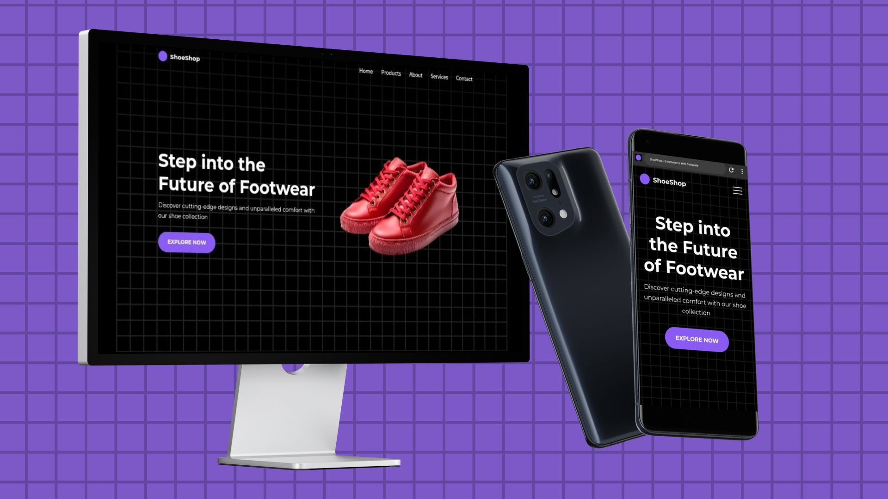
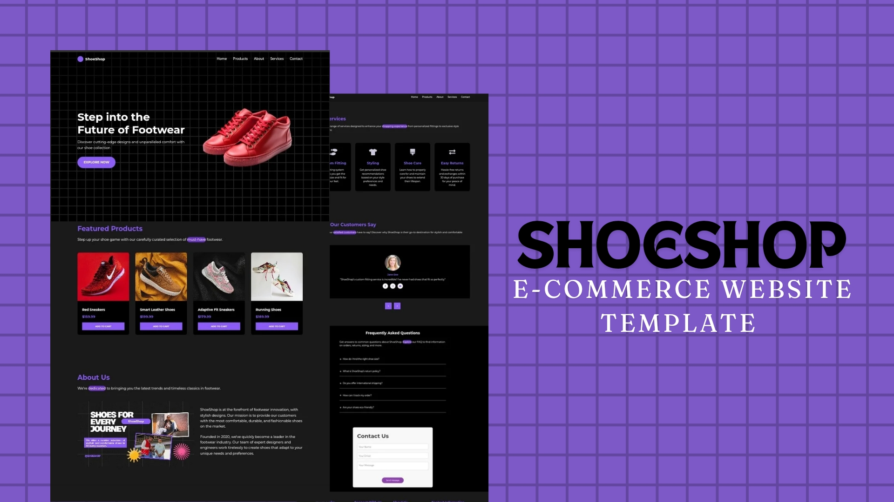

# ShoeShop - E-commerce Web Template

Explore ShoeShop's E-commerce Web Template, designed for stylish and comfortable footwear shopping experiences.

  ### Demo Files
- **Demo Video**: 
  <video controls>
    <source src="demo.mp4" type="video/mp4">
    Your browser does not support the video tag.
  </video>
- **Demo Images**:
  
  

## Table of Contents
- Introduction
- Features
- Technologies Used
- Installation
- Usage
- Contributing
- License

## Introduction
ShoeShop is an E-commerce web template crafted to showcase a range of footwear products with a focus on modern design and user experience. This template is ideal for businesses looking to create an online presence in the footwear industry.

## Features
- **Responsive Design**: Ensures optimal viewing experience across a wide range of devices.
- **Product Showcase**: Highlight featured products with detailed descriptions and pricing.
- **Navigation**: Smooth scrolling navigation with a burger menu for mobile devices.
- **Interactive Elements**: Includes carousel testimonials and FAQs for user engagement.
- **SEO Optimized**: Meta tags and social media sharing features integrated for better visibility.
- **Contact Form**: Easy-to-use form for customer inquiries.

## Technologies Used
- HTML5
- CSS3
- JavaScript (AOS library for animations)
- Font Awesome for icons
- Google Fonts (Montserrat and Inter)

## Installation
To use ShoeShop locally:
1. Clone the repository: `git clone https://github.com/JohnDev19/ShoeShop.git`
2. Navigate to the project directory: `cd ShoeShop`

## Usage
Simply open `index.html` in your web browser to view the template locally. Customize the content, styles, and images to fit your business needs.

## Contributing
Contributions are welcome! If you'd like to improve ShoeShop:
1. Fork the repository.
2. Create a new branch (`git checkout -b feature/improvement`).
3. Commit your changes (`git commit -am 'Add some feature'`).
4. Push to the branch (`git push origin feature/improvement`).
5. Create a new Pull Request.

## License
This project is licensed under the MIT License - see the LICENSE file for details.

I encourage you to contribute to the project to make it even better! Whether it’s improving the design, adding new features, or fixing bugs, your help is appreciated. Let's build something amazing together.
